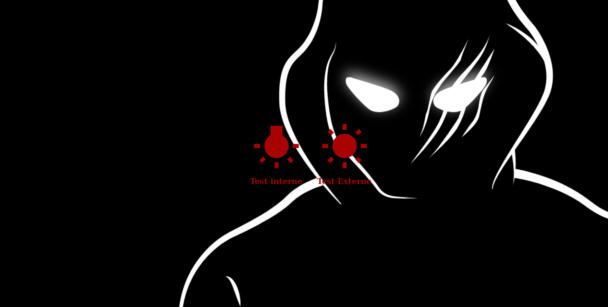
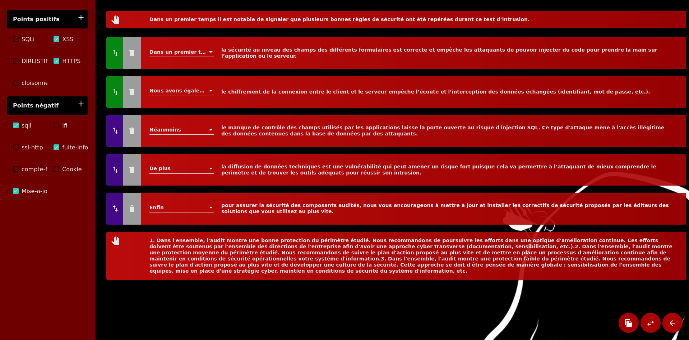

# 7kili

This project was generated with [Angular CLI](https://github.com/angular/angular-cli) version 7.3.5.

Purpuse of this project is to preset paragraphes that you can choose later to made  up a report.
It work with preset json files that you have to choose when openning the app

Then you will be able to select preset options an add modification to them.
you can also reorganise them with drag n drop.

After what you 'll be able to copy it into clipboard to past it in your favorite text editor and finalize your page layout.

## Install and run

`npm i && npm i -D sass && npm start` then go to `http://localhost:4200/`

## Build

Run `ng build` to build the project. The build artifacts will be stored in the `dist/` directory. Use the `--prod` flag for a production build.

# Contributors

| [ jenaye](https://github.com/tiboCorb) | [ tiboCorb](https://github.com/tiboCorb)
| :---: | :---: |

